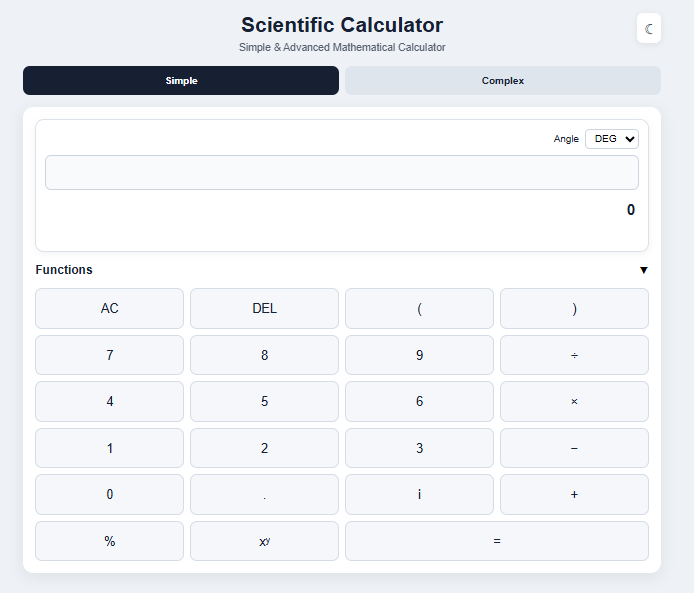
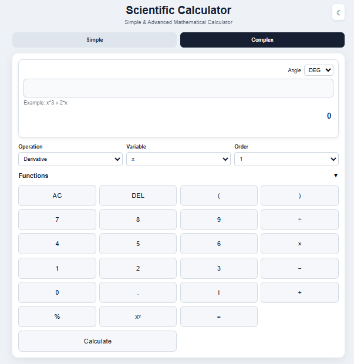

# Scientific Calculator

A Python Flask-based scientific calculator with normal and complex calculation features.

## 🚀 Live Demo

[Open Scientific Calculator](https://scientific-calculator-i2iw.onrender.com)

## 📸 Screenshots

**Simple Mode**



**Complex Mode**



## 💻 Source Code

This repository contains the complete source code of the project.

## 🛠️ Technologies

* Python
* Flask
* SymPy
* HTML
* CSS
* JavaScript

## ✨ Features

**Simple Mode**
* Standard arithmetic (+, −, ×, ÷, powers)
* Trigonometric and inverse trigonometric functions (sin, cos, tan, cot) with switchable Degree/Radian angle mode
* Logarithmic and exponential functions (log, ln, exp, sqrt)
* Factorials, absolute value, floor/ceiling, percentages
* Complex number arithmetic (using i)

**Complex Mode**
* Derivatives and integrals (adjustable order and variable)
* Equation solving
* Algebraic simplification, factoring, and expansion
* Matrix operations: determinant, inverse, transpose
* Statistics: mean, median, variance, standard deviation, min, max

**Interface**
* Responsive web UI
* Friendly error messages

## ▶️ Run Locally

```bash
git clone https://github.com/alifsadman798/scientific-calculator.git
cd scientific-calculator
pip install -r requirements.txt
python app.py
```

Then open:
```text
http://127.0.0.1:5000/
```

## 👨‍💻 Author

**Sadman Haque Bhuiyan**
GitHub: [@alifsadman798](https://github.com/alifsadman798)
